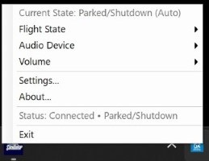
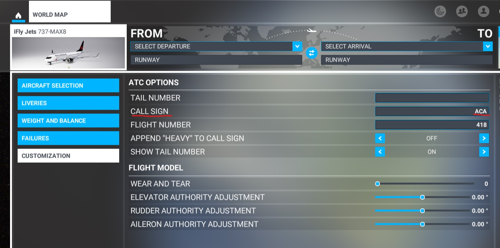
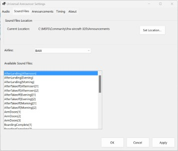

# Universal Announcer


**Plays Fenix A320 compatible Cabin Announcements on any aircraft in Microsoft Flight Simulator.**

Universal Announcer automatically detects your flight state and plays realistic cabin announcements based on your aircraft's conditions - boarding music, safety briefings, takeoff announcements, and more. Originally designed around the Fenix A320 sound files, it works with any aircraft in MSFS.

You do not need the Fenix A320 for this to work (although you should have it, it's great).

## ✈️ Features

- **Automatic Flight State Detection**: Monitors aircraft lights, engines, altitude, and ground status
- **Airline-Specific Announcements**: Supports airline folders (UAL, ACA, BAW, DAL, etc.)
- **Aircraft Type Variants**: Plays different announcements for A319, A320, A321, 737, etc.
- **Time-Based Variants**: Morning, afternoon, evening, and night announcements
- **System Tray Integration**: Minimal interface with volume control and flight state override



This app follows the announcements detailed here: https://support.fenixsim.com/hc/en-us/articles/12374580682383-Cabin-Announcements-Guide

## 🎵 Sound Files

**⚠️ IMPORTANT: No sound files are included with this application. This application does not include any copyright sound files.**

You can obtain compatible sound files from:

1. **Fenix A320 Installation**: If you own the Fenix A320, the sound files are already installed
2. **Cabin Announcements Discord**: Join the [Cabin Announcements for Fenix](https://discord.com/invite/P8ZYJgH3ZF) Discord server for community-created sound files
3. **Make You Own**: Get your tray tables in an upright position and get recording, it's just plain sound files (see [here](https://support.fenixsim.com/hc/en-us/articles/12374580682383-Cabin-Announcements-Guide) for specs)

If you don't own the Fenix then it is worth considering taking one of the Cabin Announcement packs from Discord and dropping them in a folder `Announcements\Default`, so they can be used with or without any airline code as a fallback.

## ✈️ Flight Stage Detection

A work in progress, but you can see the details here: [crazy state machine example](statemachine.md).

## 📋 System Requirements

- **Operating System**: Windows 10 or Windows 11
- **Flight Simulator**: Microsoft Flight Simulator 2020 (MSFS 2024 should work but untested, let me know)
- **Runtime**: .NET 8 (included with Windows by default)
- **Sound Files**: Compatible announcement files (see above)

## 📦 Installation

1. **Download**: Go to the [Releases](https://github.com/fearlessfrog/MSFS_Universal_Announcer/releases) section and download the latest version
2. **Extract**: Unzip the downloaded file to any directory (e.g., `D:\FunStuff\Universal Announcer\`)
3. **Run**: Double-click `UniversalAnnouncer.exe` to start the application

The application will appear in your system tray and automatically try to locate your sound files.

## 🔧 Setup

### First Launch

1. **Run the application** - It will appear in your system tray
2. **Configure sound files path** - The app will try to auto-detect your Fenix installation location, or you can browse to your sound files folder. If you don't have that, just create an `Announcements` folder somewhere, put a `Default` folder in it, and in that put a .ogg sound file.
3. **Set up MSFS** - Configure your aircraft call sign (see below)

You can also probably include this in your MSFS `exe.xml` eventually for automatic startup, although I haven't tried that yet. There are still bugs in start-up detections, so use Flight Status / Stop if annoying (you can Resume when ready).

### MSFS Configuration

This step is (probably) **temporary** while I add Navigraph simbrief plan support, but depends on demand:

For airline-specific announcements, set your **Call sign** in MSFS:

1. In MSFS, go to **World Map → Aircraft Selection → Customization (tab)**
2. Set **Call sign** to your airline code (e.g., `UAL`, `ACA`, `BAW`, `DAL` just the letters alone, no flight #)
3. The app will automatically detect your aircraft type (737, CRJ900, A320, etc.)

It looks like this, so try to remember to do it when setting a Livery:



### Sound File Structure

Your sound files should be organized like this:
```
Announcements/
├── Default/           # Fallback announcements
├── UAL/              # United Airlines
├── ACA/              # Air Canada
├── BAW/              # British Airways
└── DAL/              # Delta Airlines
```

Each folder contains files like:
- `BoardingWelcome.ogg`
- `BoardingWelcome[CRJ900].ogg` (aircraft-specific)
- `BoardingWelcome[Morning][737].ogg` (time-specific)
- `SafetyBriefing.ogg`
- `AfterTakeoff.ogg`
- And many more as per Fenix structure...

### Aircraft Types Tested

With the aircraft detection you can override what plays based on your airframe. Once simbrief is integrated then this we become more accurate, as the sim just gives the basic type only.

- PMDG 73x - Use [737]
- iFly 738M - Use [737]
- Aerosoft CRJ - Use [CRJ900] (so CRJ700, CRJ1000 etc)

Example: `SafetyBriefing[CRJ900].ogg` will be played rather than `SafetyBriefing.ogg` if in the CRJ 900.

Experiment and let me know, I'll add to this list.

## 🎮 Usage

### System Tray Menu

Right-click the system tray icon to access:

- **Flight State**: Override automatic detection or restart the sequence
- **Stop/Resume**: Pause/resume all announcements
- **Audio Device**: Select your preferred audio output
- **Volume**: Adjust announcement volume
- **Settings**: Configure sound paths and announcement types
- **About**: Version information and pretty picture

### Automatic Operation

The app automatically detects your flight phase based on things like:
- **Ground status** (on ground, parking, runway)
- **Engine status** (running, combustion)
- **Light status** (beacon, logo, landing lights)
- **Altitude and speed**
- **Spoiler deployment**

Note: I may add GSX Pro support if there is demand, but until then..

 **IMPORTANT** ⚠️ Use the Logo Light to on to indicate passengers are now boarding and get things rolling.

### Manual Override

You can manually set the flight state via the system tray menu:
- **Auto**: Let the app detect automatically (default)
- **Restart**: Reset to beginning of flight sequence
- **Cruise**: Jump to cruise phase

## 🔧 Configuration

### Announcement Types

Enable/disable specific announcements:
- Boarding Welcome & Music
- Safety Briefing
- Takeoff Announcements
- Landing Announcements
- And more...



### Audio Settings

- **Device Selection**: Choose your preferred audio output
- **Volume Control**: Adjust from 10% to 100%
- **Fallback Options**: Use Default folder if airline-specific files are missing

## 🐛 Troubleshooting

### Common Issues

1. **No sound playing**: Check your sound files path in Settings
2. **Wrong airline**: Set your MSFS Callsign to the correct airline code
3. **Announcements not triggering**: Try the manual flight state override
4. **Audio device issues**: Select your correct audio device in Settings
5. **Boarding but no musac!**: Use the Logo On light to trigger the boarding manually

### Settings & Log Files

Settings and logs are saved to: `%APPDATA%\UniversalAnnouncer\`

## 🤝 Support & Feedback

This is an initial release that I use myself. While there's no formal support, I'm interested in feedback and bug reports. Please use the GitHub Issues section to report problems or suggest improvements.

## 📜 Compatibility

- **MSFS 2020**: Fully tested and supported
- **MSFS 2024**: Should work but untested, let me know
- **Other Addons**: Compatible with most aircraft addons
- **SimConnect**: Uses standard MSFS SimConnect interface

## ⚖️ License & Disclaimer

This application is provided free of charge. The software does not include any copyrighted sound files - users must obtain compatible sound files separately.

This app is in no way associated, approved or condoned by FenixSim Ltd.

If you paid for this application, I'm sorry - especially as it's a bit fugly.

(c) 2025 fearlessfrog

---

## You're Amazing!

No, you are.

[](https://www.buymeacoffee.com/fearlessfrog)

**Happy Flying!** ✈️