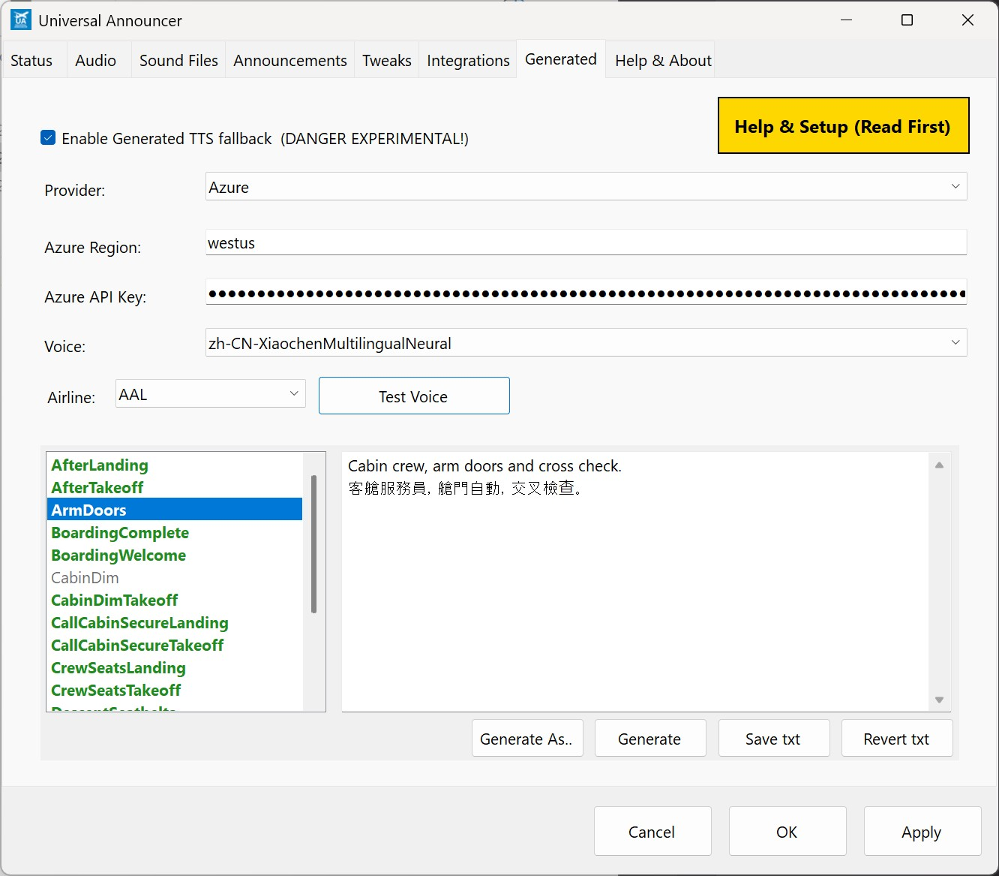

# Generated Announcements


> 💡 **Pro tip**: If you're new to the app, consider getting familiar with the basic features first.

## TL;DR Summary

🎯 **Use Windows (local), Azure, or ElevenLabs Text To Speech (TTS) to generate fully compatible sound files on the fly using your dynamic flight info**

## Important Note

> 💡 **Continue to use existing sound packs like normal - reality is best, but...**
>
> This feature doesn't replace your existing high-quality airline sound packs. It's designed to fill in the gaps when you don't have custom audio for specific announcements or airlines. Maybe you don't want to use English files all the time etc. Use real recordings when available, but let this TTS handle the rest!

## Why This Feature is Amazing

The Generated TTS feature is pretty interesting because:

- **Always Tailored**: You get announcements specifically tailored to your airline, no matter what aircraft or route you're flying
- **Local Language Support**: Announcements can be in your local language, just like real-life airline operations
- **Fully Customizable**: Edit announcements to say exactly what you want, incorporating real flight context and details
- **Cost-Effective**: Azure's free tier provides 8 hours of audio generation a month, and since these short clips are saved as reusable .ogg files in proper sound pack format, it's unlikely you'll need to pay for anything. You can use the nicer ElevenLabs as well, which has a great 'Clone Voice' feature.

## Overview

The Generated TTS feature automatically synthesizes missing airline announcements using Windows (local), Azure, or ElevenLabs Text-to-Speech, providing a seamless fallback before default audio is used. This ensures your passengers always hear appropriate announcements, even when custom audio files are missing.

## Setting up a TTS Provider

You can use Windows (local), Azure, or ElevenLabs. Windows voices are free and offline; Azure has a generous free tier; ElevenLabs has a limited free plan and paid options for cloned/custom voices. Here's how to set them up:

### Getting Started with Azure TTS
To use this feature, you'll need to set up an Azure Text-to-Speech API key. I've found two excellent step-by-step guides that walk you through the entire process:

- **[docs.merkulov.design](https://docs.merkulov.design/how-to-get-microsoft-azure-tts-api-key/)** - Comprehensive guide from account creation to API key generation
- **[VitalPBX Blog](https://vitalpbx.com/blog/how-to-create-microsoft-azure-tts-api-key/)** - Detailed walkthrough with screenshots and specific steps

**Important**: You'll need **both** your API Key and your Azure Region/Location for the app to work properly. Make sure to note both values when setting up your Azure Speech service.

### Getting Started with ElevenLabs TTS
You can sign up for a free key and try out these voices. A paid plan allows you to clone your voice and do all sorts of weird and wonderful things. There are free voices to use as well but limited compared to Azure.

Here's a short guide on how to get your API key: [ElevenLabs API Key](https://docs.aicontentlabs.com/articles/elevenlabs-api-key/)

..or to create an API key you can go here once you have an account: [https://elevenlabs.io/app/settings/api-keys](https://elevenlabs.io/app/settings/api-keys)

**IMPORTANT** If you restrict the API key you'll need the follow permissions on it for this to work:
- Text to Speech = Has Access
- Voices = Read Only (so we can list the voices in the app)
- Models = Read Only (so we can list the models in the app, the default one is usually fine)

**Models** See the ElevenLabs documentation on the best model to use. Flash is cheaper than MultiLang for example but reduced quality. In this app's case it doesn't really matter about super low latency.

### Getting Started with Windows voices (SAPI v5 / WinRT/Core)
Use locally installed Windows voices to generate audio, fully offline. Supports both classic SAPI v5 (64‑bit) voices and newer WinRT/Core voices available via Windows language packs and the Windows Speech SDK (0.5.1 added support for more Windows voices). You can also use commercial voice packs that install as SAPI v5 voices.

This option is free and simple to use. If a voice doesn't appear, ensure it is a 64‑bit SAPI v5 voice or a supported WinRT/Core voice installed for your user.


## How It All Works

### Source Text Priority
The system follows this lookup order to find announcement text to say:
1. **Airline-specific**: example: `Airline/BoardingWelcome.txt` (highest priority, an override used per airline, edit in the Generated tab with the airline selected and hit 'Save txt')
2. **Global default**: example: `Default/SafetyBriefing.txt` next priority if no airline one found (you can edit this in the app and it'll save your version in your `Default` folder)
3. **Built-in template**: Automatically copied to the airline folder on first use, of which you can always revert back to.

### Output and Storage
Generated announcements are saved as `.ogg` files alongside their corresponding `.txt` files in the airline folder. Once created, these files are reused automatically on subsequent flights (unless set to overwrite), eliminating the need for repeated API calls.

**To regenerate an announcement**: Simply edit the `.txt` file and **delete or rename** the associated `.ogg` file.

### Performance and Reliability
- **Generation timeout**: 5 seconds maximum, so generated on demand without you noticing
- **Fallback behavior**: If generation fails or times out, the normal audio fallback system takes over
- **Efficient caching**: Prevents unnecessary API usage for repeated announcements

## Example Use Case 1: Virtual Airline Setup - On the Fly Generated

Let's walk through setting up a virtual airline that doesn't have a sound pack yet and you want to generate the sound files as you go on a flight:

### Step-by-Step Setup

1. **Create Airline Folder**: Create an `XYZ` folder in your sound packs directory for your virtual 'XYZ Airlines' (or enable Airline Folder Auto Creation below)
2. **Pick a Voice**: In the new `Settings / Generated` tab choose the nationality and accent that works best for the airline, over 100 to choose from. Remember the 'Test Voice' uses your free credits, but you can select an existing announcement and try it out first. The generation uses the last one selected or use the 'Insert Voice' to put in a hint on what you want to use for this announcement.
3. **Set Up Flight**: File a SimBrief plan or set a callsign in MSFS with `XYZ 123` as your flight id
43. **Automatic Generation**: The new announcements will be generated and play with your flight info, automatically saving `.ogg` sound files as it goes, filling placeholders with real data.
5. **Add Music**: You'll still need your own `BoardingMusic.ogg` - go hunt for some disco or something classy to use! 🕺
6. **Customize Your Airline**:
   - Rename the generated files to match your preferences, e.g. `AfterTakeoff[1].ogg` to keep 'sets' of numbered files together. So either hand curate the files or let it regenerate on the fly using the placeholders.
   - Create airline-specific text files like `BoardingWelcome.txt` in your airline folder - remember it **doesn't have to be in English anymore** or use an English accent voice. The TTS works great across accents and languages.

> **Pro tip**: If you only have the `.txt` file (and no `.ogg`), the system will read it and generate the audio on demand - it's where the 'Save txt' gets saved to.


## Example Use Case 2: Virtual Airline Setup - Pregenerated Audio

Here's the steps for setting up a series of announcements up front before you fly:

### Step-by-Step Setup

1. Create the airline folder
   - In your sound packs, create `XYZ` (e.g., `...\Announcements\XYZ`). Or use Airline Folder Auto Creation to have it created for you the first time.

2. Open Settings → Generated
   - Pick your TTS voice (you can use Test Voice to hear it first).

3. Select the target airline
   - Set the Airline dropdown to `XYZ` (not Default). The Generate buttons will enable.

4. Pick a template
   - In the left template list, choose (for example) `BoardingWelcome`. Items in bold/green already have a matching `.ogg` in the selected airline.

5. Edit the text (optional)
   - Use the right editor to customize. You can use placeholders like `{AIRLINE_NAME}`, `{ORIGIN_CODE}`, `{DESTINATION_NAME}`, `{AIRCRAFT_NAME}`, `{TIME_OF_DAY}`.

6. Save the text to the airline folder
   - Click “Save txt”. This writes `XYZ\BoardingWelcome.txt` (you’ll be asked to overwrite if it already exists).

7. Generate the audio
   - Click “Generate” to create `XYZ\BoardingWelcome.ogg`, or
   - Click “Generate As..” to enter a different filename (e.g., `BoardingWelcome[1].ogg`) before saving.
   - Click “Generate All” to generate a complete set for the current flight from your selections; ideal for batch pre‑generation and respects per‑announcement Insert Voice hints.
   - Success is confirmed; the template list will refresh highlighting for files that now exist.

8. Preview and use
   - Switch to Sound Files to preview; the new `.ogg` appears under `XYZ`.
   - At runtime, the app will just play your pre‑generated `.ogg` (no TTS call needed).

Tips
- To build a set (e.g., multiple versions), repeat “Generate As..” with names like `AfterTakeoff[1].ogg`, `AfterTakeoff[2].ogg`.
- You can do the same flow with `Default` selected to pre‑generate fallback audio.

## Multi-Lingual Announcements

It is fine to put two or more languages in an announcement, but on Azure they will work better if you use a 'Multilingual' type voice. This example shows such a voice (language-Country-Name+MultilingualNeural) in use with English and Cantonese:



## Configuration

Access the Generated TTS settings in **Settings → Generated**:
- **Enable/Disable**: Toggle the feature on or off. Default off.
- **Azure Region**: Select your preferred Azure service region e.g.'westus' or 'westeurope' as you set up in Azure earlier.
- **Model**: Select your preferred ElevenLabs model, fast/turbo is fine usually and less credits.
- **API Key**: Enter your Azure or Elevenlabs Text-to-Speech API key
- **Voice**: Choose from available Azure or ElevenLabs TTS voices. Pick an accent appropriate for the airline or region.
 - **Windows Voices**: Choose from local Windows SAPI v5 and WinRT/Core voices.
 - **Airline Folder Auto Creation**: When enabled, the app will create the target airline folder automatically during generation/playback based on SimBrief or your MSFS callsign/airline selection.
 - **Automatic Generated Mode**: Optionally overwrite existing `.ogg` files automatically; optionally only when text is dynamic.

> 💡 **If the voices seem too 'clean' you can use the new 'Audio' tab 'PA Audio Mix' setting**
>
> This feature simulates the audio pattern of a PA system, with a few presets on how light or heavy. The generated voices will use this if this option is turned on (it is off by default)

### Testing Your Setup
Use the **"Test Voice"** button to verify your configuration:
- **First click**: Reads the selected template's editor text (if available) or a default test message
- **Second click**: Stops the playback

## Template Management

### Built-in Templates
The template editor displays all available built-in announcement templates. Select any template to load its content for editing.

### Template Actions
- **Save**: Writes your customizations to `Default/Name.txt` (creates a global override if no txt found in the airline)
- **Revert**: Removes the override, restoring the original built-in template
 - **Generate**: Creates the `.ogg` for the currently selected template
 - **Generate As..**: Creates the `.ogg` with a custom filename
 - **Generate All**: Generates a complete set in one click based on current Airline/voice selections; useful if you prefer manual generation without clicking each item. Respects per‑announcement Insert Voice hints.

### Per‑Announcement Voice Overrides
You can specify a different voice for each generated announcement. Use the **Insert Voice** button in the template editor to add a voice hint on the first line of the template. Overrides can be set per Default or per‑Airline template so, for example, a pilot and an attendant can use different voices and in different accents.

Over time, more first‑line hints will be added for voice SSML, e.g. speed, and emphasis. If no override is present, the global voice selection is used (the one you last set).

## 'Replace existing .ogg' Automatic Generated Mode

When generating announcements, you can allow the app to automatically overwrite existing `.ogg` files.

Options in the `Generated` tab:
- 'Replace existing .ogg' **Allow overwrite**: If enabled, generation will replace an existing sound file automatically.
- 'Regenerate only if dynamic' **Only overwrite when text is dynamic**: Restricts overwrites to templates that include dynamic placeholders (e.g., time, weather, SimBrief values), avoiding unnecessary updates when the text is static.

This is ideal for "hands‑off" workflows where your templates include dynamic placeholders and you want fresh, context‑accurate audio each flight without manual cleanup.

<a id="available-placeholders"></a>
## Available Placeholders

Enhance your announcements with dynamic content using these placeholders, so you can place these in the text:

| Placeholder | Description |
|-------------|-------------|
| `{AIRLINE_CODE}` | Airline ICAO code (e.g., DAL) |
| `{AIRLINE_NAME}` | Airline name (e.g., Delta Air Lines) |
| `{ORIGIN_CODE}` | Origin airport ICAO code (e.g., KLAS) |
| `{ORIGIN_NAME}` | Origin airport name (e.g., Harry Reid International) |
| `{ORIGIN_CITY}` | Origin city/municipality (e.g., Las Vegas) |
| `{ORIGIN_FULLNAME}` | Origin full name (e.g., Harry Reid International, Las Vegas) |
| `{DESTINATION_CODE}` | Destination airport ICAO code (e.g., KJFK) |
| `{DESTINATION_NAME}` | Destination airport name (e.g., John F. Kennedy International) |
| `{DESTINATION_CITY}` | Destination city/municipality (e.g., New York) |
| `{DESTINATION_FULLNAME}` | Destination full name (e.g., John F. Kennedy International, New York) |
| `{AIRCRAFT_CODE}` | Aircraft type ICAO code (e.g., A320) |
| `{AIRCRAFT_NAME}` | Aircraft type name (e.g., Airbus A320) |
| `{TIME_OF_DAY}` | Morning, Afternoon, or Evening (based on local sim time) |
| `{LOCAL_TIME}` | The sim's local time spoken naturally, e.g. great to use in the 'AfterLanding' for telling people what to set their watches to (do people still have watches?) 'The time here in {DESTINATION_CITY} is {LOCAL_TIME}.' == 'The time here in Chicago is 5:14pm'.|
| `{DESTINATION_WEATHER}` | Summary of the conditions from the METAR in simbrief of the destination airport. For example, if it's IFR and raining then it'll be something like 'the weather is ''not so good, with heavy rain'''. So it says a friendly general weather statement from the technical METAR it has. |
| `{DESTINATION_TEMPERATURE}` | Destination temperature in Celsius (included in phrase spoken) |
| `{DESTINATION_TEMPERATURE_F}` | As above but spoken as Fahrenheit |
| `{LOCAL_TIME_24H}` | Local time as 24‑hour HH:MM numeric (e.g., 18:05) for multilingual TTS |
| `{FLIGHT_TIME}` | Flight time spoken as spoken duration (e.g., '2 hours 14 minutes'). |
| `{FLIGHT_TIME_HHMM}` | Flight time in HH:MM numeric for multilingual TTS |
| `{DESTINATION_TEMPERATURE_C_NUM}` | Destination temperature as a numeric Celsius value |
| `{SCHED_DEP_LOCAL_24H}` | Scheduled departure in local time (origin) HH:MM |
| `{SCHED_DEP_UTC_24H}` | Scheduled departure in UTC time HH:MM |
| `{SCHED_ARR_LOCAL_24H}` | Scheduled arrival in local time (destination) HH:MM |
| `{SCHED_ARR_UTC_24H}` | Scheduled arrival in UTC time HH:MM |
| `{DEP_STATUS}` | Example outputs: 'We expect to depart on time.' / 'We are departing late.' / 'We expect to depart early.' |
| `{ARR_STATUS}` | Example outputs: 'We have arrived on time.' / 'We have arrived late.' / 'We have arrived early.' |
| `{DEP_LATE}` | Human duration, e.g., '2 hours 5 minutes' |
| `{DEP_EARLY}` | Human duration, e.g., '5 minutes' |
| `{ARR_LATE}` | Human duration, e.g., '4 hours' |
| `{ARR_EARLY}` | Human duration, e.g., '4 hours 15 minutes' |
| `{DEP_LATE_MINUTES}` | Integer minutes late (number only), e.g., 125 |
| `{DEP_EARLY_MINUTES}` | Integer minutes early (number only), e.g., 5 |
| `{ARR_LATE_MINUTES}` | Integer minutes late (number only) |
| `{ARR_EARLY_MINUTES}` | Integer minutes early (number only) |

Notes:
- If a lookup isn’t found, the placeholder resolves to empty.
- Name/city data is loaded from Tools JSON datasets shipped with the app. Feel free to edit it.
- If you are missing something from above, check out the XML Placeholders for simbrief data spelunking below.
 - Numeric placeholders above are returned as numbers so they read correctly in non‑English voices.
 - The *_MINUTES placeholders return numbers only; useful for non‑English voices/locales.

> Example valid txt entry: "Ladies and gentlemen, good {TIME_OF_DAY}. Welcome on board our {AIRLINE_NAME} flight to {DESTINATION_FULLNAME}, on this {AIRCRAFT_NAME} aircraft. Our {ORIGIN_CITY} based crew is pleased to be with you."

### Conditional Placeholder 'IF'

Use `{IF ...}` to conditionally include text based on placeholder presence or a non‑zero numeric value. The content after `{IF ...}` up to the next newline is spoken when the condition is true. Use `{END}` to wrap multi‑line conditional blocks. Blocks can be nested.

Single‑line examples:

```text
{IF ARR_LATE} We’re arriving {ARR_LATE} late today.
{IF ARR_EARLY} Good news, we’re arriving {ARR_EARLY} early.
{IF ARR_LATE_MINUTES} Numeric late minutes: {ARR_LATE_MINUTES}
```

Multiline example:

```text
{IF ARR_EARLY}
Good news, we've caught up some time and we’re arriving {ARR_EARLY} early today.
Thank you for your patience.
{END}
```

## Cruise Announcements

Use the flight's elapsed air time to trigger cruise announcements. Enable this stage in the **Announcements** tab by turning on `CruiseElapsed`. IT IS OFF BY DEFAULT!

### How triggers work
- Create files named like `Cruise.ogg` to trigger at 50% elapsed air time. It's basically an alias for 50% through.
- Or use percentage‑based names like `CruiseElapsed25Percent.ogg`, `CruiseElapsed66Percent.ogg`, `CruiseElapsed70Percent.ogg` to trigger at those points. You can have many per cruise e.g. a drinks service, breakfast before you arrive etc.
- Works from SimBrief planned en‑route time (air time). The sim's elapsed flight time is used for progress, not real time, so pausing or time acceleration is respected.
- Short flights (< ~1 hour) will compress timing slightly so mid‑cruise announcements still occur before descent.

You can provide `.ogg` files, or `.txt` files that will be generated on the fly using placeholders.

### Helpful placeholders for cruise examples
- `{LOCAL_TIME}` — spoken local time, great for after‑landing or time checks
- `{DESTINATION_WEATHER}` — friendly summary derived from destination METAR
- `{DESTINATION_TEMPERATURE}` / `{DESTINATION_TEMPERATURE_F}` — temperature in C/F
- XML lookups like `{xml_number<general><route_distance>}`, `{xml_number<general><initial_altitude>}`, `{xml_digits<general><flight_number>}` for rich SimBrief data

> Tip: The Status and system tray now show a hint of the Cruise elapsed % the app thinks you're at, to help you tune when to say thing.

Note:
- Previously, generated files had to be manually removed to regenerate. See Automatic Generated Mode below for new options to overwrite automatically.

### XML Placeholders

As of 0.4.5 you can also now directly address simbrief info from XML elements of the generated OFP.

What you do is check your simbrief generated OFP data in a web browser (e.g. https://www.simbrief.com/api/xml.fetcher.php?username=fearlessfrog) and then grab the elements you need and want to use in the announcement, e.g. these all work:

"Our captain today is ```{xml<api_params><cpt>}```."
"Flight number is ```{xml_digits<general><flight_number>}```."
"Distance today will be ```{xml_number<general><air_distance>}``` miles."

So 'xml' will just say it verbatim, 'xml_digits' will read each digit (good for a flight numbers etc) and 'xml_number' will use more human sounding number formats, e.g. '1024' is then said as 'one thousand and twenty four'.

## Best Practices

- **Keep text natural**: Write announcements as you would speak them naturally
- **Avoid complex formatting**: SSML and tag variants are not yet supported, but looking at it, e.g. pitch, speed
- **Test thoroughly**: Use the Test Voice feature to ensure your templates sound correct
- **Plan for fallbacks**: Design templates that work well even when some data is unavailable
- **Audio Mix**: Use the 'PA Audio Mix' setting on the Audio tab to simulate a PA system. Toggle off if you prefer the clean TTS output.

---

*Note: This feature provides a robust solution for missing announcements while maintaining the authentic airline experience your passengers expect.*


