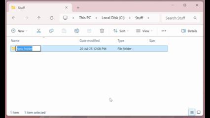
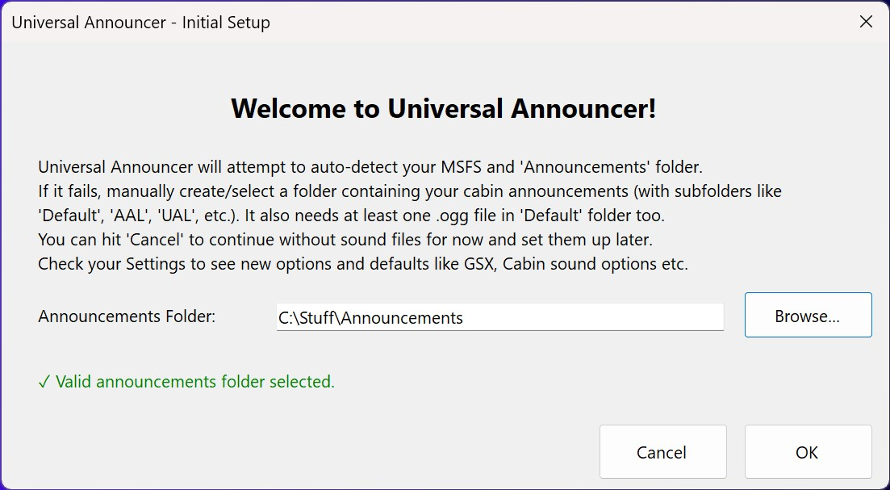

# Setting Up Sound Files

If you own the FenixSim A320 it should be detected automatically and you can point at the `Announcements` folder.

If you want to set up your own sounds files directories, then just two steps:

## Step 1

Create the folders and put the files in there. You can see I also add an airline 'UAL' folder for when United Airlines is detected:

(or see video here - https://i.imgur.com/OVZVjiY.mp4)

## Step 2

Then once you have the folders and files you can point Universal Announcer at them like this:

Done!