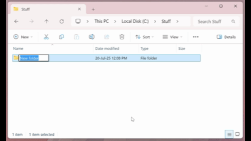
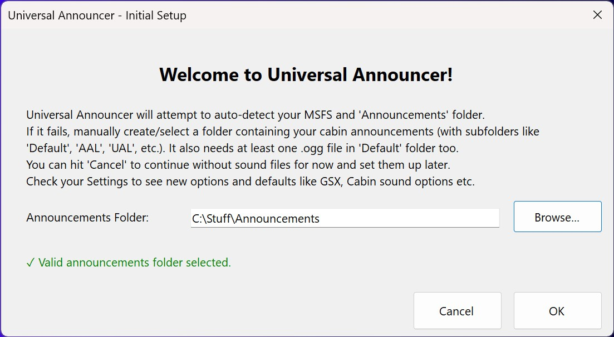

# Setting Up Sound Files

## Current manual and reference

For current instructions, see [Sound packs](https://fearlessfrog.github.io/MSFS_Universal_Announcer/manual/#sound-packs) and [Set up and preview sounds](https://fearlessfrog.github.io/MSFS_Universal_Announcer/manual/#sound-files) in the user manual. Its [All filename tags](https://fearlessfrog.github.io/MSFS_Universal_Announcer/manual/#file-tags) reference covers supported tags and links to the aircraft-family tables.

This older page is kept for reference. Where it differs, follow the manual for the application version shown on its contents page.

If you own the FenixSim A320 it should be detected automatically and you can point at the `Announcements` folder.

If you want to set up your own sounds files directories, then just two steps:

## Step 1

Create the folders and put the files in there. You can see I also add an airline 'UAL' folder for when United Airlines is detected:

(or see video here - https://i.imgur.com/OVZVjiY.mp4)

## Step 2

Then once you have the folders and files you can point Universal Announcer at them like this:

Done!